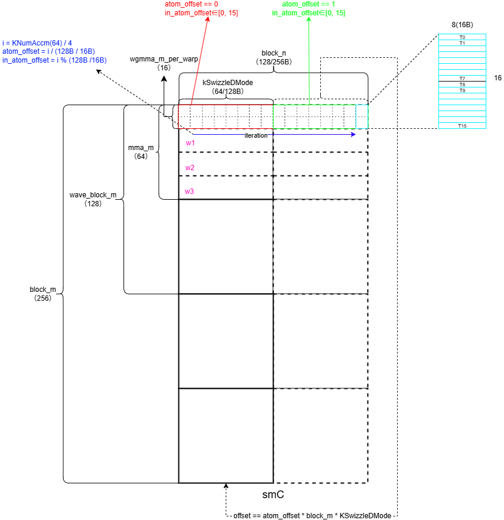
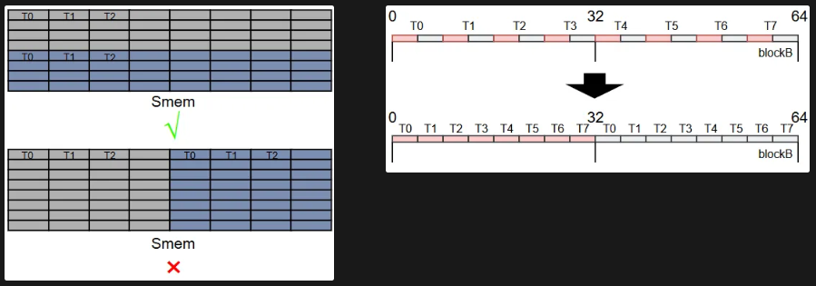

# Swizzle
- 使用swizzle去避免bank conflict  
- 主要针对 ldmatrix 和 stmatrix 指令进行的 swizzle 操作
- 代码中有两种swizzle的实现，以及多种seme shape的规避示例  
- excel文件中会将smem进行绘制，序号表示线程id，同一种颜色才会发生bank conflict，smem展示的是行优先物理内存  

- 对于正常 cuda core 的访存，gmem to smem / smem to reg 只需要保证最大粒度连续访存即可

